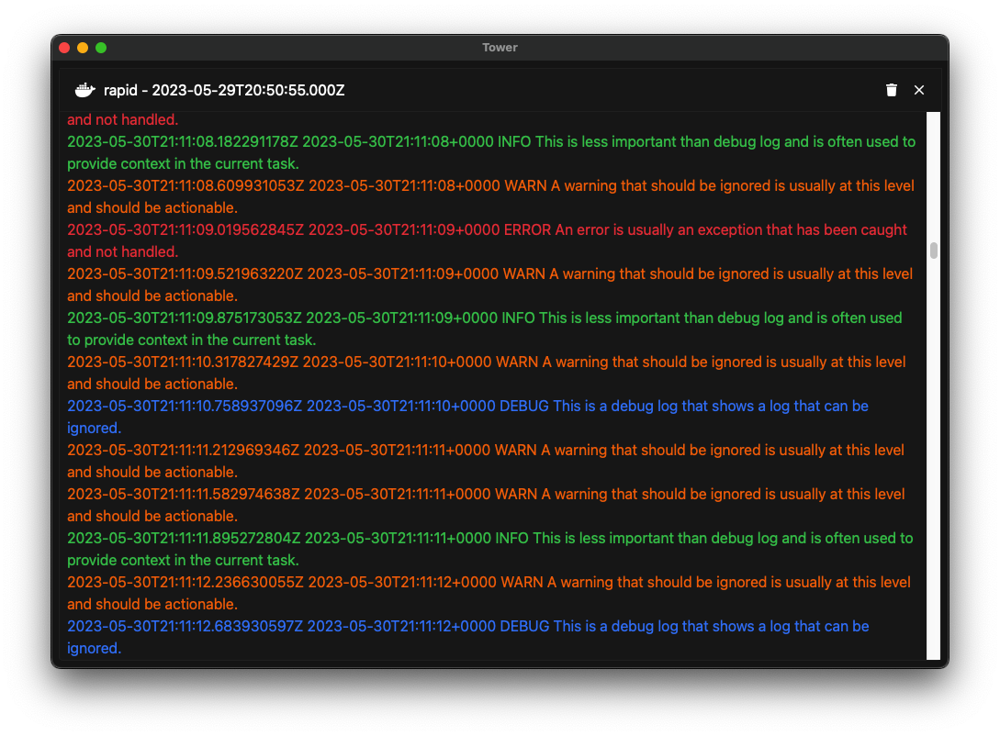

# Tower
Tower is powerfull and lightweight multi purpose toolwritten in Rust using [tauri](https://tauri.app/). 

With Tower you can :
 - browse your local docker log
 - browse your kubernetes cluster *(currently beeing built!)*

## Features
 - Small memory & CPU footprint using Rust
 - Command K support
 - Split view 

## Screenshots

